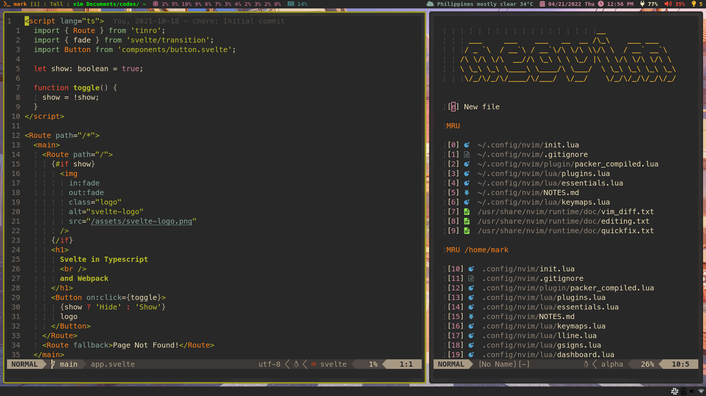

```
 __  __         _   _         __     ___
|  \/  |_   _  | \ | | ___  __\ \   / (_)_ __ ___
| |\/| | | | | |  \| |/ _ \/ _ \ \ / /| | '_ ` _ \
| |  | | |_| | | |\  |  __/ (_) \ V / | | | | | | |
|_|  |_|\__, | |_| \_|\___|\___/ \_/  |_|_| |_| |_|
        |___/
 _____                      _
| ____|_  ___ __   ___ _ __(_) ___ _ __   ___ ___
|  _| \ \/ / '_ \ / _ \ '__| |/ _ \ '_ \ / __/ _ \
| |___ >  <| |_) |  __/ |  | |  __/ | | | (_|  __/
|_____/_/\_\ .__/ \___|_|  |_|\___|_| |_|\___\___|
           |_|
```



> Mark Anthony Lumbao

### Plugin Manager: packer

### Feature List

- Native Neovim LSP with completion and diagnosis
- null-ls for code-formatting and linting
- Git commands
- Telescope
- Retrobox colorscheme I borrowed from vim's default colorschemes
- Treesitter for syntax highlights and indents
